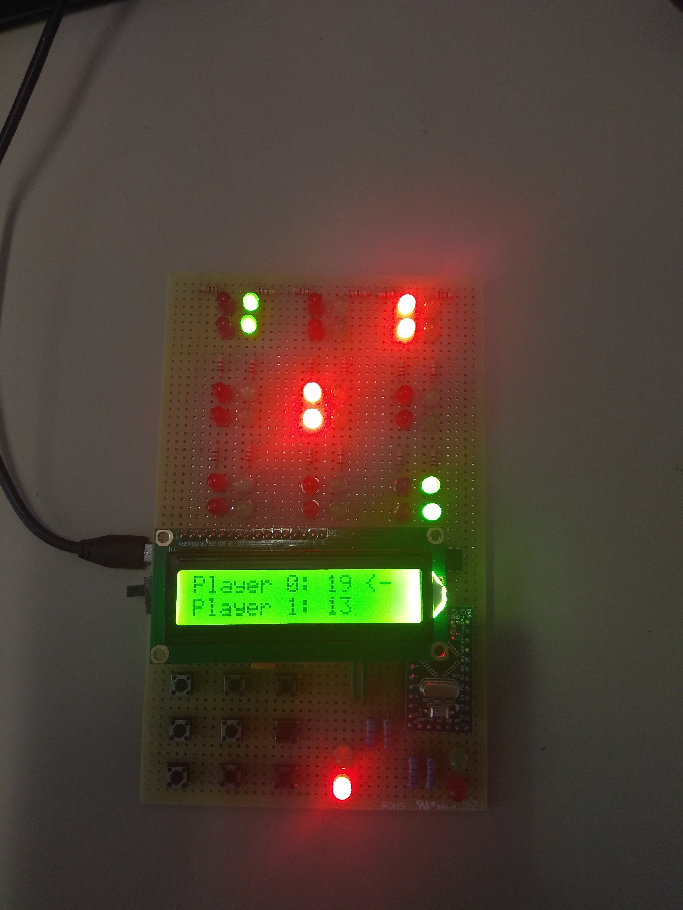
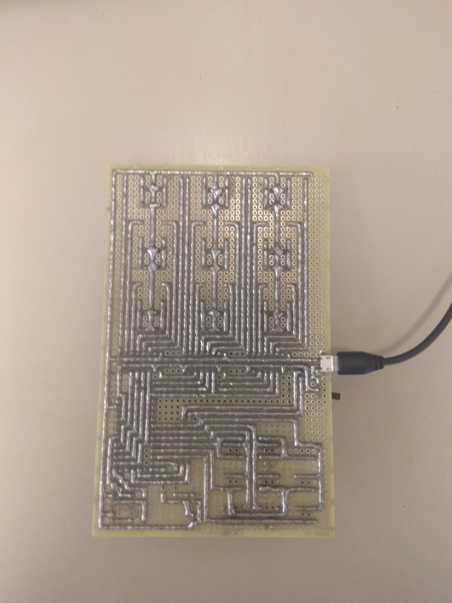

# MatrixGame

The game consist in get a matrix determinant non-zero if you are player 1 or zero if you are player 0. 
All possible matrix determinants are computed each turn to compute who is winning.
Online game also available.

 
 
